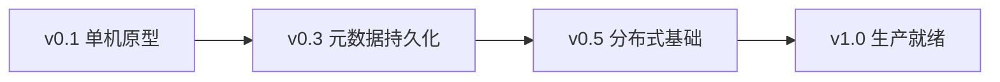
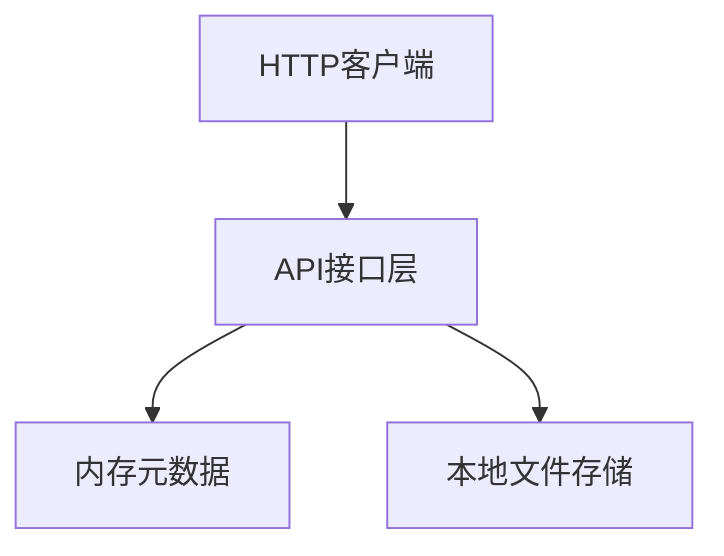
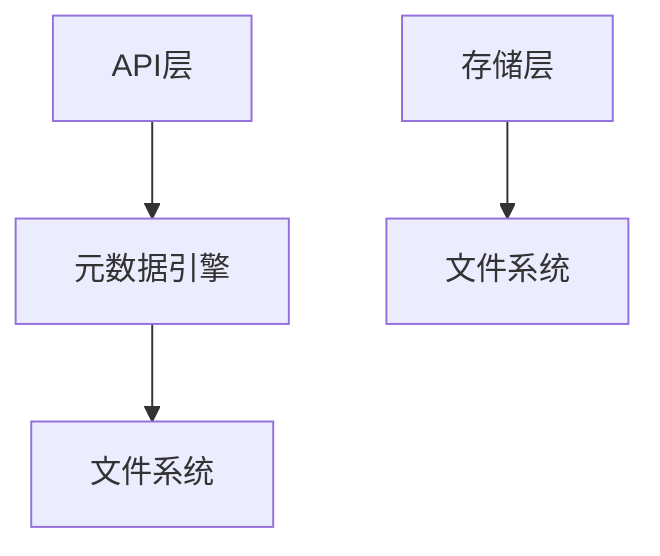
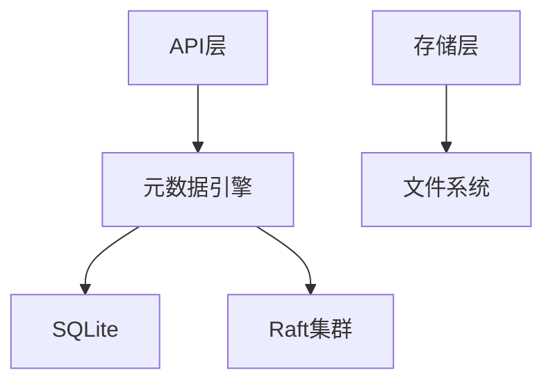
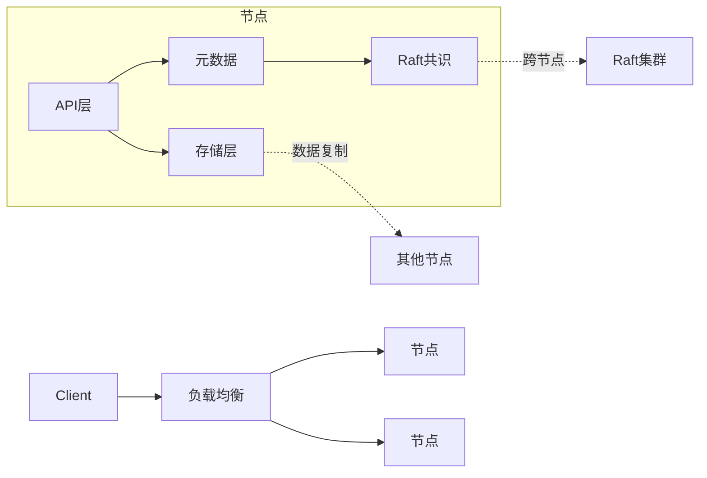
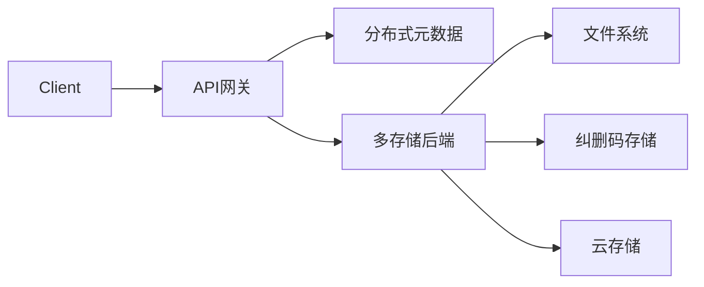

# 🗺 crab-vault 发展路线图

## 架构演进

## 详细里程碑

### 🚀 v0.1 - 单机原型 (当前)
**核心目标**: MVP基础功能

- [x] RESTful API端点 (GET/PUT/DELETE)
- [x] 内存元数据管理
- [x] 本地文件系统存储
- [x] SHA-256数据校验
- [x] 错误处理
- [x] 桶(Bucket)概念引入
- [x] 配置文件支持 (TOML格式)

### 🔒 v0.2 - 元数据持久化（文件系统）
**架构升级**:

- [x] 元数据引擎抽象层
- [x] 文件系统持久化存储
- [ ] 文件上传时自动计算元数据
- [ ] 分块上传支持

### 🔒 v0.3 - 元数据持久化（嵌入式 SQLite）
**架构升级**:

- [ ] 元数据缓存层 (LRU缓存)
- [ ] 元数据备份/恢复机制
- [ ] SQLite持久化存储
- [ ] 分块上传支持
- [ ] 基准测试套件

### 🌐 v0.5 - 分布式基础
**架构升级**:

- [ ] 引入 openraft
- [ ] 数据分片策略 (一致性哈希)
- [ ] 节点健康检查
- [ ] 数据迁移工具
- [ ] 节点自动发现
- [ ] 数据复制机制
- [ ] S3 API兼容层
- [ ] 监控指标暴露 (Prometheus)

### 🏭 v1.0 - 生产就绪
**架构升级**:

- [ ] 纠删码存储支持
- [ ] 数据冷热分层
- [ ] 服务端加密
- [ ] 权限控制系统
- [ ] 生命周期管理
- [ ] 配额管理 (存储空间/请求速率)
- [ ] 多租户隔离
- [ ] 审计日志

### 🔮 未来方向
- 全局命名空间
- 跨区域复制
- 计算存储分离
- Web控制台
- WASM插件支持

## 技术栈规划
| 组件         | v0.1       | v1.0              |
|--------------|------------|-------------------|
| **网络框架** | axum       | axum + tonic(gRPC)|
| **元数据**   | 内存HashMap| TiKV/Raft集群     |
| **存储引擎** | 本地FS     | 本地FS+纠删码     |
| **数据校验** | SHA-256    | 多级校验和        |
| **部署**     | 单进程     | K8s Operator      |
