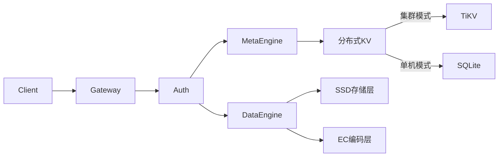

# Crab-Vault 🦀

**分布式对象存储引擎** | 高性能 | 强一致 | 云原生就绪

> 用 Rust 实现的安全、高效的对象存储系统，支持 S3 兼容接口

## 🌟 核心特性
- **跨平台单二进制**：支持 Linux/macOS/Windows 部署
- **对象操作**
    - `PUT /data/{bucket}/{object}` - 上传对象
    - `GET /data/{bucket}/{object}` - 获取对象
    - `DELETE /data/{bucket}/{object}` - 删除对象
    - `HEAD /data/{bucket}/{object}` - 获取对象元数据
- **元数据操作**
    - `PUT /meta/object/{bucket}/{object}` - 上传对象元数据
    - `PUT /meta/bucket/{bucket}/{object}` - 上传桶元数据
    - `GET /meta/object/{bucket}/{object}` - 读取对象元数据
    - `GET /meta/bucket/{bucket}/{object}` - 读取桶元数据
    - `DELETE /meta/object/{bucket}/{object}` - 删除对象元数据
    - `DELETE /meta/bucket/{bucket}/{object}` - 删除桶元数据
    - `GET /meta/object/{bucket}` - 获取某一个桶内**所有**对象的元数据
    - `GET /meta/bucket` - 获取**所有** bucket 的元数据
> 总结一下：
>
> - `data` 开头的 uri 操作对象
> - `meta` 开头的 uri 操作元数据
> 	- `/object` 开头的操作对象，而对象由 `{bucket}/{object}` 路径确定
> 	- `/meta` 开头的操作桶，后面由 `{bucket}` 确定操作的桶是哪一个
- **存储引擎**
    - 本地文件系统元数据管理
    - 本地文件系统存储
    - 数据完整性校验 (SHA-256)
- **开发友好**
    - 零配置启动
    - 单二进制部署
    - 详细日志输出

## 🧠 架构概览

