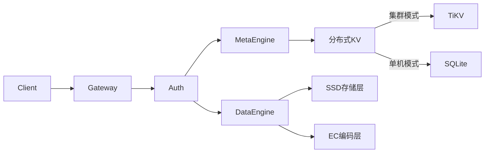

# Crab-Vault 🦀

**分布式对象存储引擎** | 高性能 | 强一致 | 云原生就绪

> 用 Rust 实现的安全、高效的对象存储系统，支持 S3 兼容接口

## 🌟 核心特性
- **跨平台单二进制**：支持 Linux/macOS/Windows 部署
- **对象操作**
    - `POST /objects/{key}` - 上传对象
    - `GET /objects/{key}` - 获取对象
    - `DELETE /objects/{key}` - 删除对象
- **存储引擎**
    - 内存元数据管理
    - 本地文件系统存储
    - 数据完整性校验 (SHA-256)
- **开发友好**
    - 零配置启动
    - 单二进制部署
    - 详细日志输出

## 🧠 架构概览
