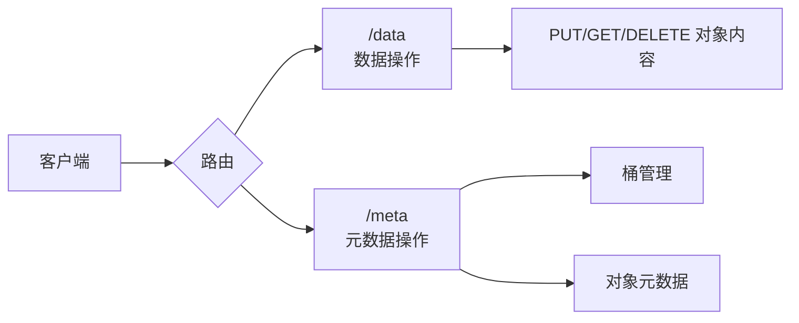
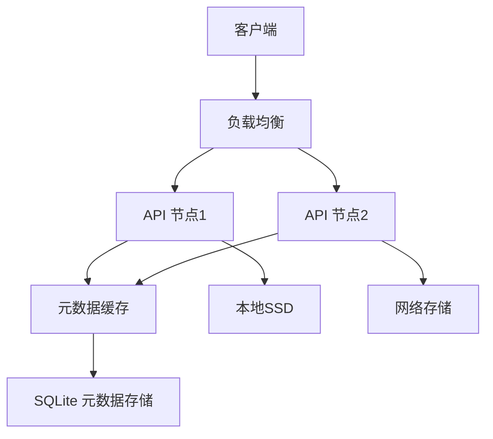

# 🦀 Crab Vault API 文档

> **对象存储服务** · 数据与元数据分离架构 · 螃蟹级可靠存储
> `v 0.2.0` · [GitHub 仓库](https://github.com/sylvan-lyon/crab-vault.git)



## 目录
- [数据操作](#-数据操作)
  - [上传对象](#-上传对象)
  - [获取对象](#-获取对象)
  - [删除对象](#-删除对象)
  - [查看对象信息](#-查看对象信息)
- [元数据操作](#-元数据操作)
  - [桶管理](#桶管理)
  - [对象元数据](#对象元数据)

---

## 📦 数据操作
> 处理实际对象内容（文件数据）

### ⬆️ 上传对象
**写入对象内容到存储引擎**

```http
PUT /data/{bucket}/{object}
```

| 参数       | 位置   | 类型     | 必填 | 说明               |
|------------|--------|----------|------|--------------------|
| `bucket`   | URL    | string   | 是   | 目标存储桶名称     |
| `object`   | URL    | string   | 是   | 对象键（路径）     |
| 文件内容   | Body   | binary   | 是   | 对象的二进制内容   |

示例请求

```bash
curl -X PUT http://localhost:8080/data/my-bucket/docs/report.pdf \
  -H "Content-Type: application/pdf" \
  --data-binary "@/reports/q3.pdf"
```

**响应：**
- `201 Created`：对象创建成功
- `400 Bad Request`：无效的桶名或对象键
- `500 Internal Server Error`：存储后端错误

---

### ⬇️ 获取对象
**读取对象内容**

```http
GET /data/{bucket}/{object}
```

| 参数     | 位置 | 类型   | 必填 | 说明           |
|----------|------|--------|------|----------------|
| `bucket` | URL  | string | 是   | 存储桶名称     |
| `object` | URL  | string | 是   | 对象键（路径） |

**示例请求：**


```bash
curl http://localhost:8080/data/my-bucket/docs/report.pdf \
  -H "Content-Type: application/pdf" \
  -o ./downloads/report.pdf
```
**响应：**

- `200 OK`：返回对象二进制内容
- `404 Not Found`：对象不存在

---

### 🗑️ 删除对象
**从存储中移除对象**

```http
DELETE /data/{bucket}/{object}
```

| 参数     | 位置 | 类型   | 必填 | 说明           |
|----------|------|--------|------|----------------|
| `bucket` | URL  | string | 是   | 存储桶名称     |
| `object` | URL  | string | 是   | 对象键（路径） |

**示例请求：**

```bash
curl -X DELETE http://localhost:8080/data/my-bucket/docs/old-report.pdf
```

**响应：**

- `204 No Content`：删除成功
- `404 Not Found`：对象不存在

---

### ℹ️ 查看对象信息
**获取对象元信息（不含内容）**

```http
HEAD /data/{bucket}/{object}
```

| 参数     | 位置 | 类型   | 必填 | 说明           |
|----------|------|--------|------|----------------|
| `bucket` | URL  | string | 是   | 存储桶名称     |
| `object` | URL  | string | 是   | 对象键（路径） |

**响应头部：**
```http
Content-Length: 102400
Content-Type: application/pdf
ETag: "d41d8cd98f00b204e9800998ecf8427e"
Last-Modified: Wed, 21 Oct 2023 07:28:00 GMT
```

**状态码：**

- `200 OK`：对象存在
- `404 Not Found`：对象不存在

---

## 📝 元数据操作
> 管理桶和对象的描述信息

### 桶管理

#### 列出所有桶
**获取系统中所有存储桶的元数据列表**

```http
GET /meta/bucket/
```

**示例响应：**

```json
[
  {
    "name": "my-bucket",
    "created_at": "2023-10-21T07:28:00Z",
    "updated_at": "2023-10-21T07:28:00Z",
    "user_meta": {
      "owner": "admin",
      "project": "crab-vault"
    }
  },
  {
    "name": "backup-bucket",
    "created_at": "2023-09-15T12:30:45Z",
    "updated_at": "2023-10-20T14:22:18Z",
    "user_meta": {
      "retention": "30d"
    }
  }
]
```

**响应：**
- `200 OK`：返回桶元数据列表
- `500 Internal Server Error`：元数据存储错误

---

#### 创建/更新桶元数据
**创建新桶或更新现有桶元数据**

```http
PUT /meta/bucket/{bucket}
```

| 参数     | 位置 | 类型   | 必填 | 说明       |
|----------|------|--------|------|------------|
| `bucket` | URL  | string | 是   | 存储桶名称 |

**请求体 (JSON):**
```json
{
  "user_meta": {
    "owner": "admin",
    "project": "crab-vault"
  }
}
```

**响应：**
- `200 OK`：操作成功
- `400 Bad Request`：无效的元数据格式
- `409 Conflict`：桶已存在（仅创建时）

---

#### 获取桶元数据
**读取指定桶的元数据**

```http
GET /meta/bucket/{bucket}
```

| 参数     | 位置 | 类型   | 必填 | 说明       |
|----------|------|--------|------|------------|
| `bucket` | URL  | string | 是   | 存储桶名称 |

**响应：** 
与创建桶相同的 JSON 结构

**状态码：**
- `200 OK`：成功返回
- `404 Not Found`：桶不存在

---

#### 删除桶
**移除桶元数据（桶必须为空）**

```http
DELETE /meta/bucket/{bucket}
```

| 参数     | 位置 | 类型   | 必填 | 说明       |
|----------|------|--------|------|------------|
| `bucket` | URL  | string | 是   | 存储桶名称 |

**响应：**

- `204 No Content`：删除成功
- `403 Forbidden`：桶非空无法删除
- `404 Not Found`：桶不存在

---

### 对象元数据

#### 列出桶内对象
**获取桶中所有对象的元数据**

```http
GET /meta/object/{bucket}
```

| 参数     | 位置 | 类型   | 必填 | 说明       |
|----------|------|--------|------|------------|
| `bucket` | URL  | string | 是   | 存储桶名称 |

**示例响应：**

```json
[
  {
    "key": "docs/report.pdf",
    "bucket_name": "my-bucket",
    "size": 102400,
    "content_type": "application/pdf",
    "etag": "d41d8cd98f00b204e9800998ecf8427e",
    "created_at": "2023-10-21T07:28:00Z",
    "updated_at": "2023-10-21T07:28:00Z",
    "user_meta": {
      "author": "crab"
    }
  },
  {
    "key": "images/logo.png",
    "bucket_name": "my-bucket",
    "size": 24576,
    "content_type": "image/png",
    "etag": "a3f4de563895e2e1b1a3f8e9f7c6b5d4",
    "created_at": "2023-10-20T14:22:18Z",
    "updated_at": "2023-10-20T14:22:18Z",
    "user_meta": null
  }
]
```

---

#### 管理对象元数据
```http
PUT /meta/object/{bucket}/{object}  # 创建/更新元数据
GET /meta/object/{bucket}/{object}   # 获取元数据
DELETE /meta/object/{bucket}/{object} # 删除元数据
```

| 参数     | 位置 | 类型   | 必填 | 说明           |
|----------|------|--------|------|----------------|
| `bucket` | URL  | string | 是   | 存储桶名称     |
| `object` | URL  | string | 是   | 对象键（路径） |

**PUT 请求体示例:**
```json
{
  "content_type": "application/pdf",
  "user_meta": {
    "author": "crab",
    "pages": 42
  }
}
```

**GET 响应示例:**
```json
{
  "key": "docs/report.pdf",
  "bucket_name": "my-bucket",
  "size": 102400,
  "content_type": "application/pdf",
  "etag": "d41d8cd98f00b204e9800998ecf8427e",
  "created_at": "2023-10-21T07:28:00Z",
  "updated_at": "2023-10-21T07:28:00Z",
  "user_meta": {
    "author": "crab",
    "pages": 42
  }
}
```

---

## 🛡️ 安全注意事项
1. 所有路径参数均经过消毒处理：
   ```rust
   // 防止路径遍历攻击
   fn sanitize_path(path: &str) -> String {
       path.replace("..", "")
          .replace('\\', "")
          .trim_matches('/')
          .to_string()
   }
   ```
2. 元数据操作不影响实际数据：
   - 删除元数据 ≠ 删除对象内容
   - 必须先删除数据再删除元数据

## 🚀 性能优化


1. **元数据缓存**：热点元数据驻留内存
2. **零拷贝传输**：使用 `tokio::fs::File` 直接传输文件
3. **并行操作**：元数据和数据操作异步并行
