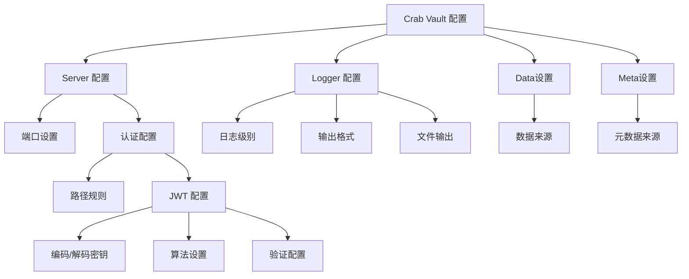

# 🦀 Crab Vault 配置文档



## 📋 配置文件结构

Crab Vault 使用 TOML 格式的配置文件，主要包含两个部分：`server` 和 `logger`。

```toml
[server]
port = 32767

# 认证配置
[server.auth]
# 路径规则数组
[[server.auth.path_rules]]
pattern = "*"
public_methods = ["ALL"]

# JWT 配置
[server.auth.jwt_config]
encoding_key = "your-base64-encoded-key"
decoding_key = "your-base64-encoded-key"
encode_algorithm = "HS256"

# JWT 验证配置
[server.auth.jwt_config.validation]
required_spec_claims = ["exp"]
leeway = 0
validate_exp = true
validate_nbf = false
validate_aud = true
aud = ["crab-vault"]
iss = ["brain-overflow"]

# 日志配置
[logger]
level = "info"
with_ansi = true
with_file = true
with_target = true
with_thread = true
dump_path = "./logs"
dump_level = "warn"

[data]
source = "./data"

[meta]
source = "./meta"
```

---

## 🖥️ Server 配置

### 基本服务器设置

| 字段 | 类型 | 默认值 | 描述 |
|------|------|--------|------|
| `port` | u16 | `32767` | 服务器监听的端口号 🚪 |

### 认证配置 (`server.auth`)

#### 路径规则 (`server.auth.path_rules`)

路径规则定义了哪些 API 端点可以无需认证访问。

| 字段 | 类型 | 默认值 | 描述 |
|------|------|--------|------|
| `pattern` | String | - | UNIX shell 风格的通配符模式，用于匹配请求路径 🎯 |
| `public_methods` | Array[HttpMethod] | `[]` | 无需认证即可访问的 HTTP 方法列表 🔓 |

**HttpMethod 可选值**:
- `GET`, `POST`, `PUT`, `PATCH`, `DELETE`, `HEAD`, `OPTIONS`, `TRACE`, `CONNECT`, `OTHER`
- `ALL` - 表示所有方法

**示例**:
```toml
# some_bucket 桶完全公开
[[server.auth.path_rules]]
pattern = "/some_bucket/*"
public_methods = ["ALL"]

# another_bucket 桶里面的所有 .av1 文件公开可访问
[[server.auth.path_rules]]
pattern = "/another_bucket/*.av1"
public_methods = ["HEAD", "GET"]
```

#### JWT 配置 (`server.auth.jwt_config`)

JWT 配置用于设置令牌的编码、解码和验证规则。

| 字段 | 类型 | 默认值 | 描述 |
|------|------|--------|------|
| `encoding_key` | String (Base64) | `""` | 用于编码 JWT 的 HMAC 密钥，Base64 编码 🔑 |
| `decoding_key` | String (Base64) | `""` | 用于解码 JWT 的 HMAC 密钥，Base64 编码 🔑 |
| `encode_algorithm` | String | `"HS256"` | JWT 编码算法 🧮 |

**支持的算法**:

- `HS256`, `HS384`, `HS512` - HMAC 算法
- `RS256`, `RS384`, `RS512` - RSA 算法
- `ES256`, `ES384` - ECDSA 算法
- `PS256`, `PS384`, `PS512` - RSA-PSS 算法

#### JWT 验证配置 (`server.auth.jwt_config.validation`)

JWT 验证配置用于设置令牌验证的详细规则。

| 字段 | 类型 | 默认值 | 描述 |
|------|------|--------|------|
| `required_spec_claims` | Array[String] | `["exp"]` | 必须包含的声明字段 📋 |
| `leeway` | u64 | `0` | 过期时间宽容值（秒）⏰ |
| `reject_tokens_expiring_in_less_than` | u64 | `0` | 提前使有效的令牌过期（秒）⏳ |
| `validate_exp` | Boolean | `true` | 是否验证过期时间 ✅ |
| `validate_nbf` | Boolean | `false` | 是否验证"not before"时间 ✅ |
| `validate_aud` | Boolean | `false` | 是否验证受众 ✅ |
| `aud` | Array[String] | - | 合法的受众列表 👥 |
| `iss` | Array[String] | - | 合法的签发者列表 🏢 |
| `sub` | String | - | 合法的主题 📝 |
| `decode_algorithms` | Array[String] | `["HS256"]` | 允许的解码算法列表 🧮 |

**示例**:
```toml
[server.auth.jwt_config.validation]
required_spec_claims = ["exp", "iat", "jti"]
leeway = 60  # 1分钟宽容值
reject_tokens_expiring_in_less_than = 60 # 决绝将在 60 秒后过期的令牌
validate_exp = true
validate_nbf = true
validate_aud = true
aud = ["crab vault"]  # 只接受目标为 crab vault 的令牌
iss = ["brain overflow"]  # 只接受 brain overflow 签发的令牌
decode_algorithms = ["HS256", "HS512"]  # 允许的算法
```

---

## 📝 Logger 配置

日志配置用于控制应用程序的日志输出行为和格式。

| 字段 | 类型 | 默认值 | 描述 |
|------|------|--------|------|
| `level` | String | `"trace"` | 控制台日志输出级别 📊 |
| `with_ansi` | Boolean | `true` | 是否在控制台使用彩色输出 🌈 |
| `with_file` | Boolean | `true` | 是否在日志中显示文件名 📁 |
| `with_target` | Boolean | `true` | 是否在日志中显示模块路径 🎯 |
| `with_thread` | Boolean | `true` | 是否在日志中显示线程信息 🧵 |
| `dump_path` | String | - | 日志文件输出目录 📂 |
| `dump_level` | String | `"warn"` | 文件日志输出级别 📊 |

**日志级别可选值**:
- `trace` - 最详细的日志级别
- `debug` - 调试信息
- `info` - 一般信息
- `warn` - 警告信息
- `error` - 错误信息

**注意事项**:
- `dump_level` 仅在设置了 `dump_path` 时有效
- 如果设置了 `dump_path` 但未设置 `dump_level`，默认为 `warn`

**示例**:
```toml
[logger]
# 控制台输出 info 及以上级别的日志
level = "info"

# 使用彩色输出
with_ansi = true

# 显示文件名和模块路径
with_file = true
with_target = true

# 不显示线程信息
with_thread = false

# 将 warn 及以上级别的日志输出到文件
dump_path = "./logs"
dump_level = "warn"
```

---

## 🚀 最佳实践

### 1. 生产环境配置示例

```toml
[server]
port = 8080

[server.auth]

# 健康检查公开访问
[[server.auth.path_rules]]
pattern = "/health"
public_methods = ["GET"]

# 指标端点公开访问
[[server.auth.path_rules]]
pattern = "/metrics"
public_methods = ["GET"]

# 其他所有端点需要认证
[[server.auth.path_rules]]
pattern = "*"
public_methods = []  # 空数组表示需要认证

[server.auth.jwt_config]
encoding_key = "aGVsbG8td29ybGQ="  # Base64 编码的密钥
decoding_key = "aGVsbG8td29ybGQ="  # Base64 编码的密钥
encode_algorithm = "HS256"

[server.auth.jwt_config.validation]
required_spec_claims = ["exp", "iat", "jti"]
leeway = 30
validate_exp = true
validate_nbf = true
validate_aud = true
aud = ["crab-vault"]
iss = ["brain-overflow"]
decode_algorithms = ["HS256"]

[logger]
level = "info"
with_ansi = false  # 生产环境通常不需要彩色输出
with_file = true
with_target = true
with_thread = false
dump_path = "/var/log/crab-vault"
dump_level = "warn"
```

### 2. 开发环境配置示例

```toml
[server]
port = 32767

[server.auth]
# 开发环境所有端点公开访问
[[server.auth.path_rules]]
pattern = "*"
public_methods = ["ALL"]

[server.auth.jwt_config]
encoding_key = "dev-key-base64-encoded"  # 开发环境密钥
decoding_key = "dev-key-base64-encoded"  # 开发环境密钥
encode_algorithm = "HS256"

[logger]
level = "debug"  # 开发环境使用更详细的日志
with_ansi = true  # 开发环境使用彩色输出
with_file = true
with_target = true
with_thread = true
# 开发环境可以不输出到文件
# dump_path = "./logs"
# dump_level = "debug"
```

### 3. 安全建议

1. **密钥管理**:
   - 生产环境使用强密码生成密钥
   - 定期轮换密钥
   
2. **路径规则**:
   - 最小权限原则：只公开必要的端点
   - 定期审查路径规则，确保没有意外暴露敏感端点

3. **日志管理**:
   - 生产环境将日志输出到文件，便于审计和故障排查
   - 设置适当的日志保留策略
   - 敏感信息不要记录在日志中

---

## ❤️ 默认配置

```toml
[server]
port = 32767

# 默认情况下，所有，注意是所有 API 都会收到最严格的保护，除了根路径下的 OPTION，这个请求会被 CORS 层处理
# [[server.auth.path_rules]]
# public_methods = ["GET", "DELETE"]
# pattern = "*/*.json"

[server.auth.jwt_config]
encoding_key = ""
decoding_key = ""
encode_algorithm = "HS256"

[server.auth.jwt_config.validation]
required_spec_claims = "exp"
leeway = 0
reject_tokens_expiring_in_less_than = 0

validate_exp = true
validate_nbf = false
validate_aud = false

# 默认情况下，这三个字段都是没有的，如果需要添加，请务必留意数据类型
# iss = ["brain overflow"]
# aud = ["crab vault"]
# sub = "None"

decode_algorithms = ["HS256"]

[logger]
level = "trace"
with_ansi = true
with_file = true
with_target = true
with_thread = true
# 默认情况下是没有文件日志输出的
# dump_path = "log"
# dump_level = "info"

[data]
source = "data"

[meta]
source = "meta"
```


## 🔧 故障排除

### 常见问题

1. **端口冲突**:
   ```toml
   # 检查端口是否被其他应用占用
   [server]
   port = 32767  # 尝试更换端口
   ```

2. **JWT 验证失败**:
   ```toml
   # 确保编码和解码密钥一致，当然 RSA 就必须验证密钥对是否匹配了
   [server.auth.jwt_config]
   encoding_key = "same-key"
   decoding_key = "same-key"  # 必须与 encoding_key 相同
   ```

3. **路径规则不生效**:
   ```toml
   # 确保模式格式正确
   [[server.auth.path_rules]]
   pattern = "/api/*"  # 使用通配符匹配多个路径
   public_methods = ["GET"]
   ```

4. **日志文件无法写入**:
   ```toml
   # 确保应用有写入权限
   [logger]
   dump_path = "/path/with/write/permission"
   ```

### 获取帮助

如果您遇到配置问题，可以通过以下方式获取帮助：

1. 检查应用日志获取详细错误信息
2. 查阅本文档的相关章节
3. 在项目 GitHub 页面提交 Issue
4. 联系我

> 🦀 祝您使用 Crab Vault 愉快！如有任何问题，请随时联系我们。