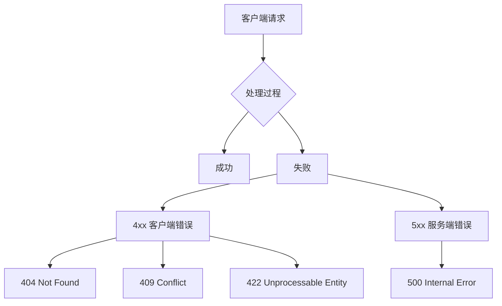
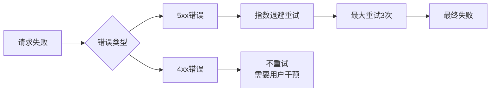

# 🦀 Crab Vault 错误处理文档

[toc]

> **优雅的错误处理** · 清晰的错误信息 · 螃蟹级的问题诊断 
> 当事情不如预期时，Crab Vault 会提供详细的错误信息来帮助您快速定位问题！



## 📋 错误响应格式

所有错误都遵循统一的JSON格式：

```json
{
  "code": "errorType",
  "msg": "人类可读的错误描述",
  // 详细的错误信息上下文
}
```

---

## 💾 I/O 错误
**代码：** `io` 
**HTTP状态码：** `500 Internal Server Error`

当文件系统操作失败时触发，比如读写文件、创建目录等。

```json
{
    "code": "io",
    "msg": "io error: No such file or directory (os error 2) while manipulating /data/my-bucket/file.txt",
    "path": "/data/my-cucket/my-file.txt"
}
```

**可能原因：**
- 📁 存储目录权限不足
- 💾 磁盘空间已满
- 🔧 文件系统损坏
- 🚫 路径不存在或无效

---

## 🔄 序列化错误
**代码：** `serde` 
**HTTP状态码：** `500 Internal Server Error`

当JSON序列化或反序列化失败时触发。

```json
{
    "code": "serde",
    "msg": "ser/de error: syntax at line 5, column 23",
    "error": "syntax",
    "line": 5,
    "column": 21
}
```

**可能原因：**

- 📝 无效的JSON格式
- 🔠 字符编码问题
- 🧩 数据类型不匹配
- 📋 元数据格式错误

---

## 🔍 资源不存在错误
**HTTP状态码：** `404 Not Found`

### 存储桶不存在
**代码：** `bucketNotFound`

```json
{
    "code": "bucketNotFound",
    "msg": "bucket not found: my-nonexistent-bucket",
    "bucket": "my-nonexistent-bucket"
}
```

### 存储桶元数据不存在
**代码：** `bucketMetaNotFound`

```json
{
    "code": "bucketMetaNotFound",
    "msg": "bucket meta not found: my-bucket",
    "bucket": "my-bucket"
}
```

### 对象不存在
**代码：** `objectNotFound`

```json
{
    "code": "objectNotFound",
    "msg": "object not found: my-bucket/nonexistent-file.txt",
    "bucket": "my-bucket",
    "object": "nonexistent-file.txt"
}
```

### 对象元数据不存在
**代码：** `objectMetaNotFound`

```json
{
    "code": "objectMetaNotFound",
    "msg": "object meta not found: my-bucket/file.txt",
    "bucket": "my-bucket",
    "object": "file.txt"
}
```

**可能原因：**
- 🎯 资源已被删除
- ✏️ 名称拼写错误
- ⏰ 资源尚未创建
- 🔄 并发删除操作

---

## ⚠️ 冲突错误
**代码：** `bucketNotEmpty` 
**HTTP状态码：** `409 Conflict`

当尝试删除非空的存储桶时触发。

```json
{
    "code": "bucketNotEmpty",
    "msg": "bucket not empty: possibly while deleting: details my-bucket",
    "bucket": "my-bucket"
}
```

**解决方案：**
1. 先删除桶内所有对象
2. 然后重试删除桶操作
3. 或者使用强制删除选项（如果支持）

---

## 🚫 参数错误
**代码：** `invalidArgument` 
**HTTP状态码：** `422 Unprocessable Entity`

当提供无效参数时触发。

```json
{
    "code": "invalidArgument",
    "msg": "invalid argument: Bucket name cannot contain uppercase letters"
}
```

**常见问题：**
- 🔠 无效的存储桶命名（大写字母、特殊字符等）
- 📏 超出长度限制
- 🎯 无效的对象键格式
- 📋 不符合命名规范

---

## 🔧 其他错误

### 后端错误
**代码：** `backendError` 
**HTTP状态码：** `500 Internal Server Error`

```json
{
  "code": "backendError",
  "msg": "backend error: Database connection timeout"
}
```

### 其他错误
**代码：** `other` 
**HTTP状态码：** `500 Internal Server Error`

```json
{
  "code": "other",
  "msg": "some other errors: Unexpected internal state"
}
```

---

## 🛠️ 错误处理最佳实践

### 客户端处理建议
```javascript
async function handleCrabVaultRequest() {
  try {
    const response = await fetch('/my-bucket/file.txt');
    if (!response.ok) {
      const error = await response.json();
      
      switch (error.code) {
        case 'bucketNotFound':
          // 创建存储桶或提示用户
          break;
        case 'objectNotFound':
          // 上传对象或显示404页面
          break;
        case 'bucketNotEmpty':
          // 先清空存储桶再重试
          break;
        default:
          // 记录日志并显示通用错误
          console.error('Crab Vault Error:', error);
      }
    }
  } catch (error) {
    // 网络错误或其他异常
  }
}
```

### 重试策略


### 监控和日志
- 📊 记录所有5xx错误到监控系统
- 🔍 4xx错误可以帮助发现客户端问题
- 📝 使用`code`字段进行错误分类统计
- 🚨 设置告警针对频繁的`io`和`backendError`

---

## 🐛 故障排除指南

### 常见问题排查

| 错误现象 | 可能原因 | 解决方案 |
|---------|---------|---------|
| 频繁`io`错误 | 磁盘权限问题 | 检查存储目录读写权限 |
| `serde`错误 | 元数据损坏 | 验证客户端发送的JSON格式 |
| 大量`404` | 客户端缓存过期 | 实现缓存失效机制 |
| `409 Conflict` | 并发操作冲突 | 添加重试逻辑和乐观锁 |

### 调试技巧
1. **启用详细日志**：
   ```bash
   RUST_LOG=debug ./crab-vault
   ```

2. **检查网络连接**：
   ```bash
   curl -v http://localhost:32767/health
   ```

3. **验证存储后端**：
   
   ```bash
   df -h .  # 检 crab-vault 挂载点的空间占用
   ls -la /data  # 检查文件权限
   ```

---

## 📞 获取帮助

如果遇到无法解决的错误：

1. 📋 收集错误信息（包括完整的JSON响应）
2. 📝 记录操作步骤和请求头
3. ⏰ 注意错误发生的时间点
4. 🐛 检查服务日志获取更多细节
5. 📧 联系支持团队并提供以上信息

> 🦀 记住：每个错误都是学习的机会！Crab Vault 的详细错误信息就是为了帮助您快速定位和解决问题。
